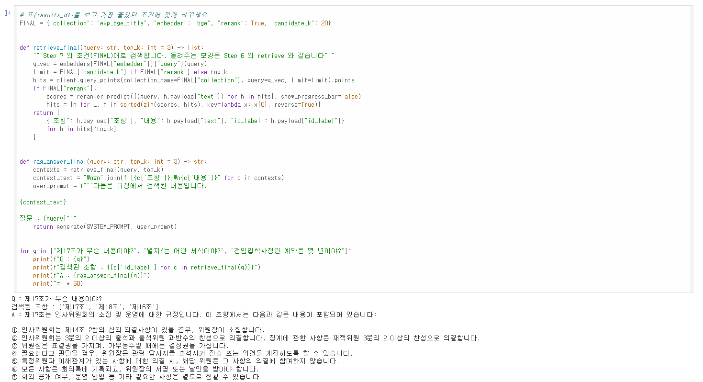
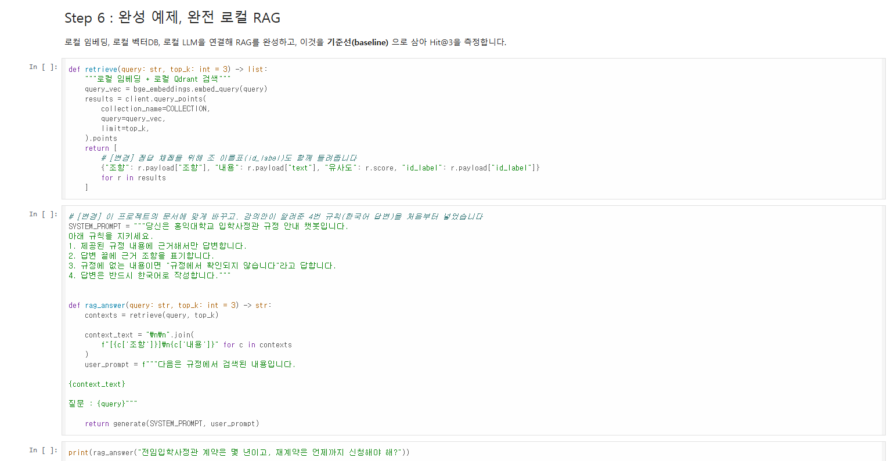
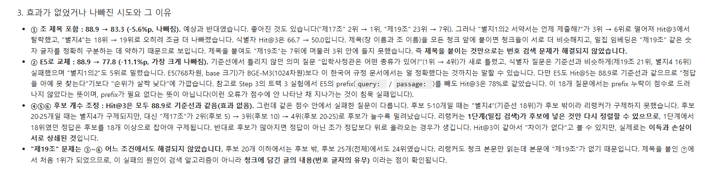
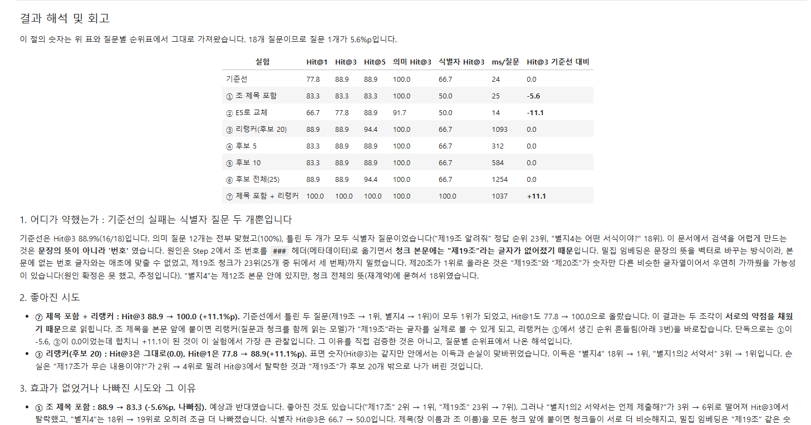
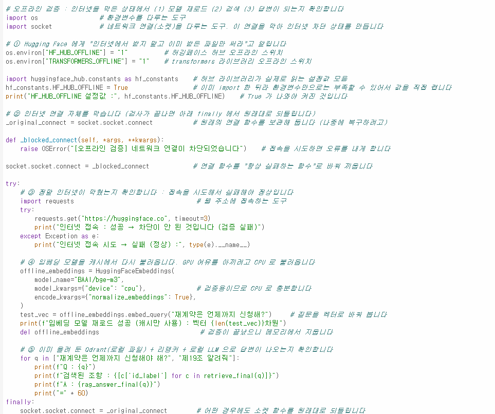

# AIFFEL Campus Online Code Peer Review Templete
- 코더 : 이승화
- 리뷰어 : 황인성


# PRT(Peer Review Template)
- [x]  **1. 주어진 문제를 해결하는 완성된 코드가 제출되었나요?**
    
    
- [x]  **2. 전체 코드에서 가장 핵심적이거나 가장 복잡하고 이해하기 어려운 부분에 작성된 
주석 또는 doc string을 보고 해당 코드가 잘 이해되었나요?**
    
        
- [x]  **3. 에러가 난 부분을 디버깅하여 문제를 해결한 기록을 남겼거나
새로운 시도 또는 추가 실험을 수행해봤나요?**
    
        
- [x]  **4. 회고를 잘 작성했나요?**
    
        
- [x]  **5. 코드가 간결하고 효율적인가요?**
    


# 회고(참고 링크 및 코드 개선)
```
여러 시도를 하시는 걸 보면서 상황이 개선되는 점이 정말 좋았습니다.
코드를 보면서 나도 이렇게 하면 더 개선이 되었을까? 라는 생각이 들었습니다.
정리도 잘 되어 있어서 읽기 좋았습니다.
```
